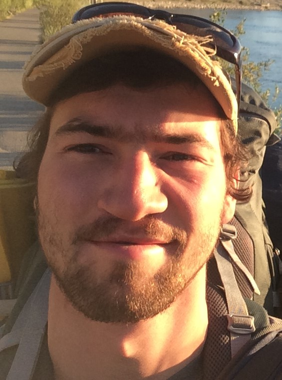
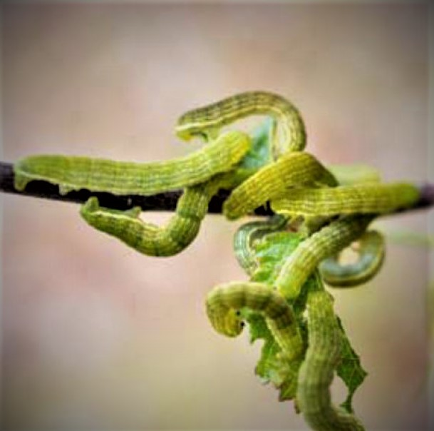

```{r setup, include=FALSE}
htmltools::tagList(rmarkdown::html_dependency_font_awesome())
```

\

 <div class="container">
  
</div> 

\

<div style="font-size:10px">
*Disclaimer: I don't update this website very often. Last update = June 2022* 
</div> 

___




Hello! My name is Florent (Flo is fine), I'm a PhD student at University Laval, Québec, Canada interested in several aspects related to the ecology of ungulates. My advisors are [S. Hamel <i class="fa fa-external-link" style="font-size:13px"></i>](https://sites.google.com/site/sandrahamel18/){target="_blank"}, [J.-P. Tremblay <i class="fa fa-external-link" style="font-size:13px"></i>](http://www.cef-cfr.ca/index.php?n=Membres.JeanPierreTremblay){target="_blank"}, and [N.G. Yoccoz <i class="fa fa-external-link" style="font-size:13px"></i>](https://en.uit.no/ansatte/person?p_document_id=41160){target="_blank"}.

My MSc project was focused on studying the drivers of vigilance in mountain goats and how it relates to their fitness. I've also worked on intrinsic and extrinsics determinants of molt timing in mountain goats before (see [visual abstract <i class="fa fa-external-link" style="font-size:13px"></i>](https://www.researchgate.net/publication/331131245_Individual_condition_and_access_to_food_resources_modulate_end_of_molt_in_a_mountain_ungulate){target="_blank"} or manuscript ([see "Papers" section <i class="fa fa-hand-o-down" style="font-size:13px"> </i>](#papers)). 

My original motivation for research came from undergraduate project investigating the spatial behavior of caribou in relation to Randonnée skiers (Backcountry skiers) in the Atlantic-Gaspésie mountain-dwelling caribou population, in eastern Canada. 

\

<p float="left" align="middle">
<figure style="width:100%;">
  
   
   
  <figcaption>A female caribou, a female mountain goat and a female white-tailed deer</figcaption>
</figure>
</p>

\

# Papers

E-mail me if a paywall is bothering you ([see "Contact" section <i class="fa fa-hand-o-down" style="font-size:13px"> </i>](#contact) <i class="fa-hand-o-down" style="font-size:13px"></i>)! 

- **Déry, F.**, Hamel, S., & Côté, S. D. (2020). Linking proximate drivers and fitness returns of vigilance: Offspring from more vigilant mothers survive better. *(submitted)*
- **Déry, F.**, Hamel, S., & Côté, S. D. (2019). Getting ready for the winter: Timing and determinants of molt in an alpine ungulate. *Ecology and Evolution*, **9**, 2920–2932. doi: [10.1002/ece3.4970](https://doi.org/10.1002/ece3.4970){target="_blank"} <i class="fa fa-unlock" aria-hidden="true" style="font-size:13px"></i>
- Lesmerises, F., **Déry, F.**, Johnson, C. J., & St-Laurent, M.-H. (2018). Spatiotemporal response of mountain caribou to the intensity of backcountry skiing. *Biological Conservation*, **217**, 149–156. doi: [10.1016/j.biocon.2017.10.030](https://doi.org/10.1016/j.biocon.2017.10.030){target="_blank"} <i class="fa fa-lock" style="font-size:13px"></i>

\

# Workplaces

```{r map_capture, echo=FALSE, message=FALSE, warning=FALSE}
require(tidyverse); require(sf); require(knitr); require(leaflet)

areas=read.csv("areas.csv", header=TRUE, dec=".", sep=",")

areas_sf =areas %>%
  st_as_sf(coords = c("long", "lat"), crs = 4326)


leaflet(areas,width = "100%") %>% 
  addProviderTiles(providers$Stamen.Toner) %>% 
  addCircleMarkers(
    clusterOptions = markerClusterOptions(FALSE),
    radius = 8,
    color = "orange",
    stroke = TRUE,
    fillOpacity = .5,
    popup= paste("Region : ", areas$Area,"<br>",
                 areas$Type, "<br>",
                 areas$Description, "<br>")
  ) %>% 
    leafem::addMouseCoordinates()


```
<p style="font-size:16px" > *Interactive map of places I've been during my career so far. Click on a location for more information.* </p> 

\

# Future

My actual PhD research focus is to model stress factors in northern ecosystems by using near-term iterative forecasting (hereafter [NTIF <i class="fa fa-external-link" style="font-size:13px"></i>](https://www.pnas.org/content/115/7/1424){target="_blank"}) approach in the context of adaptive management of harvested resources. 

More precisely, global changes are altering trophic interactions involving consumer-resource and parasite-host relationships in northern ecosystems. Global warming and altered precipitation regime already favour the northern expansion of parasites and cause wide variations in the intensity and frequency of pest insect outbreaks. 

In this context, I started a PhD during fall 2020 to obtain predictions from NTIF approach and provide insights on the relative contribution of environmental variability, management decisions and stress factors on trophic interactions and the resilience of two northern ecosystems:

1. I will model the dynamics of winter tick abundance, distribution, and their effects on moose population dynamics in eastern North America. 
2. I will develop models of egg-hatching dates of geometrid moths in subarctic mountain birch forests of Norway. 

In both systems, several hypotheses and relationships need to be included to accurately predict the effect of stress factors, which is why I consider NTIF the best approach to quantify where and what information must be combined to actual knowledge. 

<figure style="width:20%; float:left; min-width:1.2in"">
  <p> 
  <figcaption> Autumnal moth<br>larvae © partner.<br>sciencenorway.no/ </figcaption>
</figure>

### Climate as a common driver in both systems

In both systems, climate as a major role in the impact of stress factors. Indeed, cold temperature and snow cover limit winter ticks fall activity, late-winter reproduction and survival, whereas co-occurrence and abundance patterns of two geometrid moth species largely depend on temperature and birch phenology. I plan to combine several variables available at coarse and fine spatial scale and will access data inputs on yearly to daily timescale. 

### Collaborative science and research partners

I have lunched a collaborative science program that will in spring 2021, in which we invite hunters and stake holders to submit moose observations and pictures of camera-traps installed on their respective properties or allowed lands. This program will provide crucial information on hair loss, a pathology caused by winter ticks. Moreover, I hope to use this data to feed some demography and condition data in the moose system at a finer spatio-temporal scale. As for the birch and moth system, My aim is to spatially forecast egg-hatching dates, comparing different models, to try to see if (a)synchrony between egg-hatching dates and bud burst is a predictor of outbreaks and or larval densities. For this chapter, I'll build models from data gathered through a systematic review on incubation parameters of these moths. I will have access to extensive database from the Climate-ecological Observatory for Arctic Tundra ([COAT <i class="fa fa-external-link" style="font-size:13px"></i>](www.coat.no/en/){target="_blank"}). 

\

# About

<figure style="width:30%; float:right; min-width:2.1in"">
  <p> 
  <figcaption> An attempt at<br>"arting" on a<br>pizza box </figcaption>
</figure>

I speak english and french, few mostly outdoor-related norwegian words and I know around 16 words of italian (excluding the pasta ones). I could be considered as an highly irregular artist, as I sometimes crave drawing and painting in the next minute, ending up using the back of a pizza box, or anything close that will act as a spontaneous medium. I like blues, jazz root, some folk, and other music as well. I play some guitar (always the same blues rhythm over and over again), but I'm better with a harmonica. 

I also like screwdrivers, and no I'm not talking about the drink, but the actual handtool (although I do like the drink too), especially when they have a wooden handle. 

\

# Contact

<i class="fa fa-paper-plane-o" style="font-size:25px"></i> florent.dery@gmail.com

<i class="glyphicon glyphicon-envelope" style="font-size:25px"></i> Postal address : Département de biologie, U. Laval - 1045 av. de la médecine, Québec (Qc), G1V 0A6

<i class="fab fa-researchgate" style="font-size:36px"></i> [Research Gate](https://www.researchgate.net/profile/Florent_Dery){target="_blank"}   

 [ORCID](https://orcid.org/0000-0003-1978-838X){target="_blank"} 

<i class="fab fa-twitter-square" style="font-size:36px"></i> [Twitter](https://twitter.com/florentdery){target="_blank"}

 Carrier pigeon : Université Laval ; Birdcage #15 - slot #12

\
<p float="left" align="middle"> *Feel free to contact me if you'd like to ask questions about my work, shared interests or insights!* </p>
